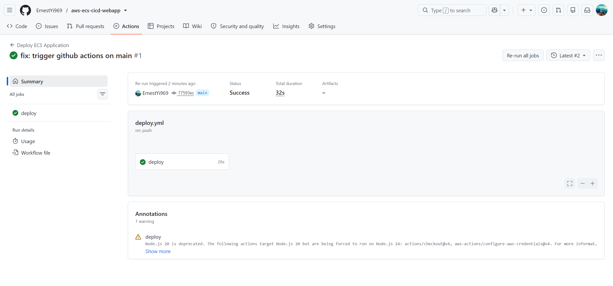
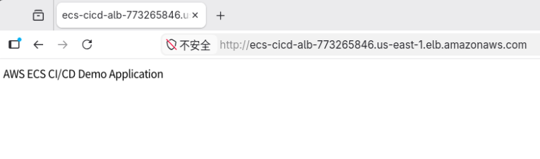

# AWS ECS CI/CD Web Application AWS ECS CI/CD 网络应用程序

A containerized Flask web application deployed on AWS ECS Fargate.
一个部署在 AWS ECS Fargate 上的容器化 Flask Web 应用程序。

## Architecture 架构

Local:
本地：

Browser 浏览器
↓
Docker Container Docker 容器
↓
Flask Application Flask 应用程序


## Tech Stack 技术栈

- Python Flask
- Docker
- AWS ECS Fargate
- Amazon ECR
- Application Load Balancer
- Terraform
- GitHub Actions

## Local Run 本地构建

Build image:
构建镜像：

``` bash 命令
docker build -t ecs-cicd-demo ./app
``` 

Run container:
运行容器：

```bash 命令
docker run -p 5000:5000 ecs-cicd-demo
```

## Deployment Flow 部署流程

1. Push code to GitHub
1. 推送代码到GitHub

2. GitHub Actions builds Docker image
2. GitHub Actions 构建 Docker 镜像

3. Push image to Amazon ECR
3. 推送镜像到亚马逊 ECR

4. Update ECS service
4. 更新 ECS 服务

5. ECS Fargate deploys new task
5. ECS Fargate 部署新任务


Infrastructure
基础设施

Provisioned by Terraform:
由 Terraform 配置：

- VPC
- ALB
- ECS Fargate
- ECR
- IAM
- CloudWatch Logs

## Architecture 架构


## GitHub Actions



## Demo 演示

